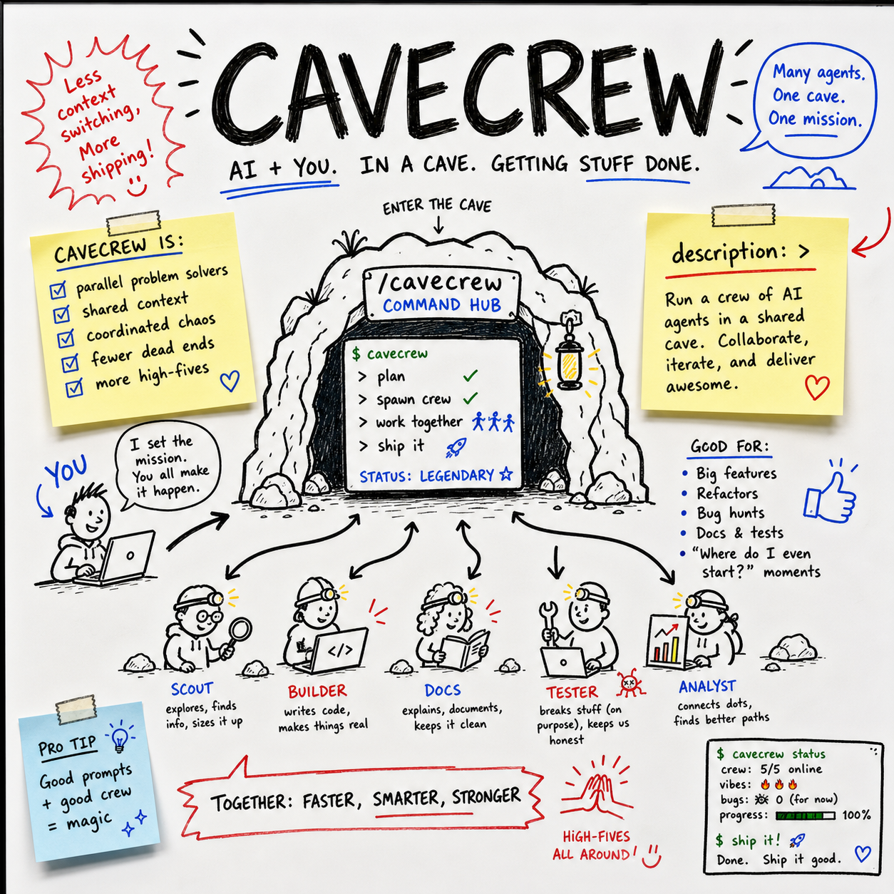

# claude-skill-cavecrew-plus




> **Built on [JuliusBrussee/caveman](https://github.com/JuliusBrussee/caveman)** by @JuliusBrussee (93,514 stars, MIT). All credit for the original idea to them. This fork improves and repackages it; upstream license preserved in [UPSTREAM_LICENSE](UPSTREAM_LICENSE).

**A Claude Code skill for choosing focused investigator, builder, and reviewer subagents for bounded code tasks.**

Built for developers who want terse, structured delegation that plugs into an existing Claude Code workflow.

## 🪨 Why Cavecrew Plus?

Delegation can cost more context than it saves.

Broad agents may return long explanations when you only need locations, edits, or defects. Builders may also expand a small task into an unsafe multi-file change.

Cavecrew Plus defines strict contracts for three focused roles:

- `cavecrew-investigator` locates code without modifying it.
- `cavecrew-builder` makes clear edits limited to one or two files.
- `cavecrew-reviewer` inspects a defined scope for actionable defects.

Use it when structured results matter more than extended prose. Keep trivial questions and cross-cutting work in the main thread.

## ⚡ Install

```bash
mkdir -p ~/.claude/skills/cavecrew-plus && curl -fsSL https://raw.githubusercontent.com/claude-skill-cavecrew-plus/claude-skill-cavecrew-plus/main/skill/SKILL.md -o ~/.claude/skills/cavecrew-plus/SKILL.md
```

The skill is a single Markdown file with zero runtime dependencies.

## 🧭 Usage

Ask Claude Code to use Cavecrew for a bounded task:

```text
The CLI crashes when config.toml omits timeout. Use cavecrew and keep the fix small.
```

Claude should select the appropriate role, beginning with an investigator when the edit location is unknown. A discovery result follows this shape:

```text
Definitions:
- src/config.ts:42 — `timeout` — reads the required config value
Tests:
- test/config.test.ts:18 — `loads defaults` — covers missing optional fields
totals: 1 definition, 1 test.
```

If the target is clear and the complete change fits within two files, the builder can edit and verify it. If not, it must stop with `too-big.`, `needs-confirm.`, `ambiguous.`, or `regressed.`.

The core rules are:

1. Delegate only when setup costs less than inline work.
2. Use investigators for read-only discovery.
3. Use builders only for obvious one-file or two-file edits.
4. Use reviewers for defect-focused inspection of a defined scope.
5. Keep architecture work, new features, and cross-cutting refactors in the main thread.

## 🔧 What we changed vs upstream

- Reframed Cavecrew as a general guide for bounded code delegation, with clearer triggers and less promotional token-saving language.
- Expanded the agent-selection guidance, including when delegation overhead makes inline work preferable.
- Made the investigator contract stricter about scope, naming variants, match classification, line numbers, and read-only behavior.
- Added detailed builder safety rules covering the two-file limit, unrelated changes, verification, destructive actions, and external side effects.
- Defined the builder’s terminal statuses precisely and clarified that required tests, generated output, and configuration count toward the file limit.

## 📄 License

Released under the [MIT License](LICENSE). The upstream MIT license and attribution are preserved in [UPSTREAM_LICENSE](UPSTREAM_LICENSE).